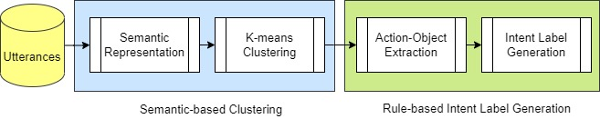

# Open Intent Discovery through Unsupervised Semantic Clustering and Dependency Parsing


## Introduction
Intent understanding plays an important role in dialog systems, and is typically formulated as a supervised learning problem.
However, it is challenging and time-consuming to design the intents for a new domain from scratch, which usually requires a lot of manual effort of domain experts.
This project presents an unsupervised two-stage approach to discover intents and generate meaningful intent labels automatically from a collection of unlabeled utterances in a domain,
as illustrated in the following figure.



In the first stage, we aim to generate a set of semantically coherent clusters where the utterances within each cluster convey the same intent.
We obtain the utterance representation from various pre-trained sentence embeddings and apply clustering methods.
In the second stage, the objective is to generate an intent label automatically for each cluster.
We extract the ACTION-OBJECT pair from each utterance using a dependency parser and take the most frequent pair within each cluster, e.g., book-restaurant, as the generated intent label.
We empirically show that the proposed unsupervised approach can generate meaningful intent labels automatically and achieve high precision and recall in utterance clustering and intent discovery.

## Source Code
This repository contains the core code for running the experiments. The SNIPS dataset is preprocessed from https://github.com/sonos/nlu-benchmark. Please cite their paper if you use the dataset.

### How to run the experiments?
The batch script can be run as follows:
```
bash batch.sh
```

## Citation
If you use the released source code in your work, please cite the following paper:

<pre>
@article{liu2021open,
  title={Open Intent Discovery through Unsupervised Semantic Clustering and Dependency Parsing},
  author={Liu, Pengfei and Ning, Youzhang and Wu, King Keung and Li, Kun and Meng, Helen},
  journal={arXiv preprint arXiv:2104.12114},
  year={2021}
}
</pre>


## Report
Please feel free to create an issue or send emails to the first author at ppfliu@gmail.com.
